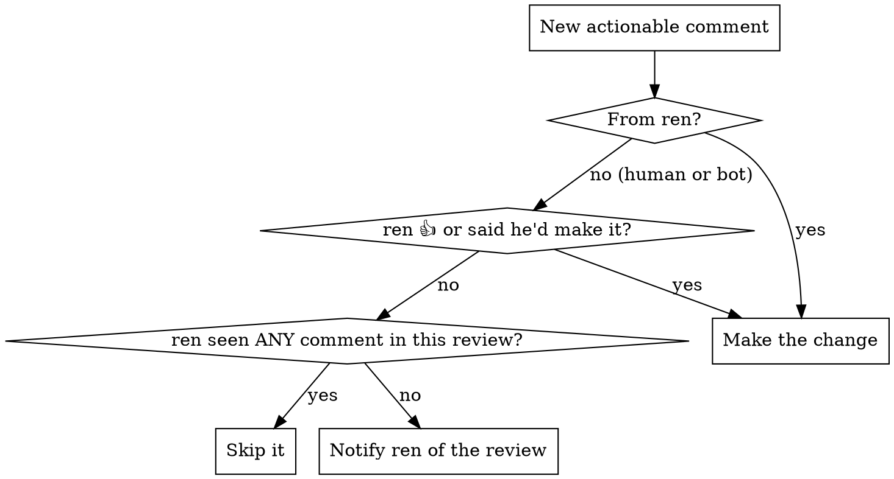

# Monitor PR

Babysit a PR on a repeating interval: keep its pipeline green, keep it current with
its base branch, act on review comments, move it out of draft when ready, and
squash-merge it once it's fully approved.

You drive `gh` (GitHub) and `idp` (Toast CI builds) via `Bash`. This skill runs a
loop — it does not stop after one pass. It keeps going until ren stops it or the PR
is merged.

## Setup (once, before the loop)

1. **Resolve the PR.** From the argument (number or URL). Capture repo, PR number,
   `headRefName` (feature branch), `baseRefName`, and draft status:
   `gh pr view <pr> --json number,isDraft,baseRefName,headRefName,url,mergeable,reviewDecision`.
2. **Determine mode** (draft PRs only): **safe** (default) or **unsafe**. Use unsafe
   ONLY if ren explicitly said so. See [Draft PR](#draft-pr).
3. **Check for session-archives** for this PR (see ren's session-archives convention).
   Remember whether they exist — several steps below update them "if they exist".
4. Confirm to ren: which PR, which mode, 10-minute interval.

## The loop

Every **10 minutes**, run one full pass of the logic below, then park cheaply until
the next pass:

- Park with a `Bash` `sleep 600` and an explicit `timeout: 610000` on the call
  (Bash defaults to a 120s timeout and would kill a bare `sleep 600` at exit 143).
- On each wake, re-fetch PR state and run the [General](#general-draft-and-non-draft)
  logic first, then the draft- or non-draft-specific logic.

Stop the loop when the PR merges, or when ren tells you to stop.

## General (draft AND non-draft)

Run all three of these every pass, in order.

### 1. Base branch changes

If the base branch has commits the feature branch doesn't, **merge base into feature**
(merge, never rebase — per ren's convention):
`git fetch origin && git merge origin/<baseRefName>`.

If there are conflicts, resolve them by **keeping BOTH sets of changes** — never drop either side. Then push.

#### Exception: `toastweb` and `toastmobile` on base branch `development`
Do NOT merge on every pass. `development` moves so fast that merging
each pass restarts CI before it can finish, trapping the loop so you never see a
pipeline complete. Instead, first attempt the merge only to detect conflicts (e.g.
`git merge --no-commit --no-ff origin/development`):
- **Conflicts** → resolve them keeping BOTH sides, commit, and push (this is the only
  case where you push a base merge for these repos).
- **No conflicts** → abort the merge (`git merge --abort`) and leave the branch as-is;
  do not merge `development` in just because it's ahead.

This exception applies ONLY to `toastweb`/`toastmobile` on base `development`. Every
other repo, and those two repos on any other base branch, follow the default rule above.

### 2. Pipeline failure

Check the most recent CI run (`gh pr checks <pr>`; for Toast build detail/logs use
`idp builds list <repo> --branch <headRefName> --status failed` and
`idp builds logs <repo> <id>`). If the most recent run **failed**, diagnose it:

- **Transient / flaky** → rerun the pipeline. Easiest: `idp builds trigger <repo> --branch <headRefName>`.
  - Can't rerun directly? → merge base into feature (§1) to trigger a fresh run.
  - No base changes to merge? → push a **no-op commit followed by an undo commit** to
    force a new run (e.g. an empty `git commit --allow-empty`, or add-then-remove a
    throwaway line in two commits).
- **Not transient** (a real failure) → fix the issue and push. If session-archives
  exist for this PR, update them.

### 3. New review comments

Build the set of review threads: `gh api graphql` for `reviewThreads` with
`isResolved`, each comment's `author`, `body`, and reactions;
and `reviews` for approval/changes-requested state.

**Which comments count** (filter first):

- Only consider a comment **suggesting a change** — or whose thread has a reply
  suggesting a change. Ignore everything else (praise, questions, FYIs).
- Ignore **resolved** threads.
- **Never respond to any comment.**

**Who left it:**

- **From ren** (`renaudchauret-toast`): make ALL his suggested changes and push.
- **From anyone else (human or bot):** make the change if ren reacted 👍 to it, OR
  replied indicating he'd make it. Otherwise: if ren has **not** reacted to, replied
  to, or resolved **any** comment from that one review, he likely hasn't seen it —
  **notify him** (see [Notifying ren](#notifying-ren)). Don't guess; just notify.

**After making any changes:**

1. Push the changes.
2. **Resolve each thread you made a change for** (`gh api graphql` resolveReviewThread).
3. Do **not** resolve threads you didn't change.
4. Do **not** respond to any comment.
5. If session-archives exist for this PR, update them.

## Draft PR

### Safe mode (default)

Move the PR out of draft (`gh pr ready <pr>`) once **BOTH** hold:
1. The most recent pipeline run passed, **and**
2. ren has signed off on the PR.

**What counts as ren's sign-off** (any ONE of these — many repos block authors from
approving their own PRs, so a formal approval isn't always possible):
1. A GitHub PR **approval** from ren (`renaudchauret-toast`).
2. A comment from ren on the PR saying **"approve"** / "approved" or a ✅ checkmark
   (`:white_check_mark:` / `:heavy_check_mark:`) — as a review comment.
3. ren **telling you directly** that he approves.

Any one of the three is sufficient; you do NOT need all of them.

### Unsafe mode

Move it out of draft as soon as the most recent pipeline run passed. **Only use unsafe
mode if ren explicitly told you to** — never default to it.

## Non-draft PR

Squash-merge (`gh pr merge <pr> --squash`) only if **ALL** of these hold:

1. The most recent CI pipeline run passed.
2. Approved by a **human other than ren**.
3. Approved by **all humans who previously requested changes**.
4. No human approval left comments requesting changes — counting only each person's
   **most recent** review if they reviewed more than once.

If all conditions are met but GitHub blocks the squash-merge (branch protection,
required checks, etc.), **notify ren** — don't force it.

If all conditions are met but Claude auto-mode classifier denies permission to make the change,
try **asking ren** for explicit approval; don't just give up and tell ren to merge it himself.

## Notifying ren

"Notify ren" adapts to whether the afk skill's away mode is active:

- **Away mode ON** → post to **#ren-claude** via `slack_send_message` (resolve the
  channel per the afk skill), with a one-line summary of the PR and why you're pinging.
- **Away mode OFF** → surface a clearly-marked message in the terminal.

Notify, then keep looping — don't block the loop waiting on a reply.

## Quick reference

| Need | Command |
|------|---------|
| PR state | `gh pr view <pr> --json isDraft,baseRefName,headRefName,mergeable,reviewDecision,reviews` |
| CI status | `gh pr checks <pr>` |
| Toast build detail / logs | `idp builds list <repo> --branch   --status failed` / `idp builds logs <repo> <id>` |
| Rerun pipeline | `idp builds trigger <repo> --branch  ` |
| Merge base → feature | `git fetch origin && git merge origin/<base>` |
| Review threads (resolved, reactions) | `gh api graphql` on `reviewThreads` |
| Resolve a thread | `gh api graphql` resolveReviewThread mutation |
| Out of draft | `gh pr ready <pr>` |
| Squash-merge | `gh pr merge <pr> --squash` |

## Common mistakes

- **Rebasing the base branch.** ren merges base into feature — never rebase.
- **Dropping a side in a conflict.** Keep both sets of changes.
- **Merging `development` every pass on toastweb/toastmobile.** Those repos churn too
  fast — merge only to resolve conflicts, else the loop never sees CI finish.
- **Responding to comments.** Never reply; only make changes and resolve.
- **Resolving threads you didn't change.** Only resolve what you fixed.
- **Defaulting to unsafe mode.** Safe mode is the default; unsafe requires ren's word.
- **Relying on a stale review read.** Re-fetch `reviewDecision`/`latestReviews` right
  before the merge check — approvals can land mid-pass; don't reuse the earlier snapshot.
- **Stopping after one pass.** This is a loop — keep going until merged or told to stop.
